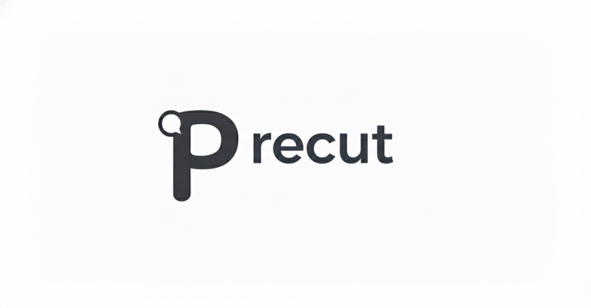
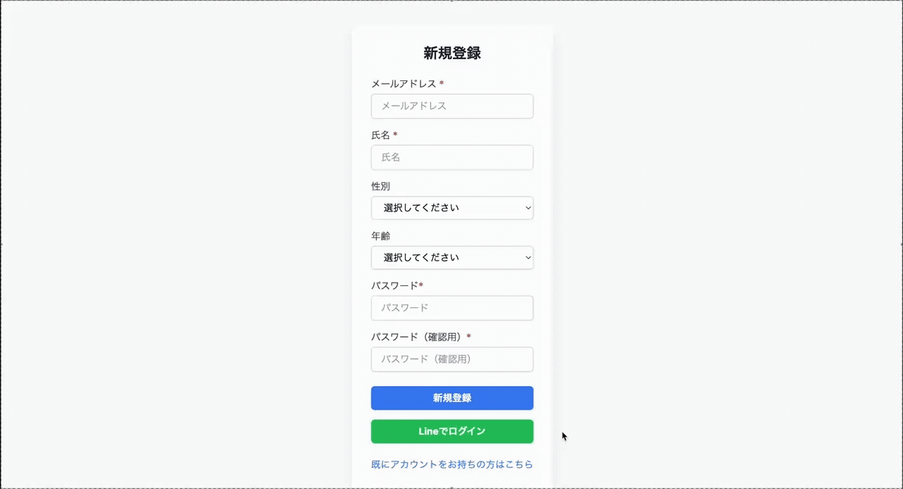

# precut

サービスURL : https://my-pre-cut.com/

## ■ 目次
- [サービス概要](#-サービス概要)
- [サービス開発の背景](#-サービス開発の背景)
- [ユーザー層について](#-ユーザー層について)
- [機能紹介](#-機能紹介)
- [技術構成について](#-技術構成について)
  - [使用技術](#使用技術)
  - [画面遷移図](#画面遷移図)
  - [ER図](#er図)
## ■サービス概要
― 来店前に“なりたい”を共有できる、美容室のための事前カウンセリングWebアプリ ―

## ■ サービス開発の背景
美容師として働く中で、「どう伝えればいいか分からない」「うまくオーダーできなかった」「前と同じでいいけど説明が面倒」といったお客様の声を多く耳にしてきました。
また、サロンでは限られた時間の中でお客様の情報を初めて聞き出すため、本音を引き出しきれなかったり、施術時間が圧迫されてしまったりすることもあります。

👨‍🎨 美容師としての経験から：

 - 「なりたいイメージがあるけど伝えづらい」と感じているお客様が多い
 - 「もっと事前に情報が分かっていれば、もっと提案できたのに」と思う場面が多かった

👩‍🦰 お客様の気持ちから：

 - 「似合う髪型がわからない」「こういうのは嫌だ、と言いづらい」など、カウンセリングに心理的ハードルがある
 -  チャット形式なら、緊張せずに気持ちを整理して伝えられる
 -  来店前に要望を伝えることで、当日のカウンセリングも短く、安心感を持って任せられる

⸻
だからこそ、美容師もお客様も“事前に理解し合える”体験をつくる、
そのためのプロダクトとして開発しようと決めました。

## ■ ユーザー層について
- 美容室ユーザー（顧客側）：自分の髪型や悩みを伝えるのが苦手な方
- 美容師側（プロ側）：カウンセリング時間を有効に使いたい方
## ■ 機能紹介

| ユーザー登録 / ログイン |
| :---: | 
| |
| 
『メールアドレス』『名前』『パスワード』『確認用パスワード』を入力、『性別』『年齢』は任意で選択してユーザー登録を行います。ユーザー登録後は、自動的にログイン処理が行われるようになっており、そのまま直ぐにサービスを利用する事が出来ます。 また、LINEアカウントを用いてLINEログインを行う事も可能です。
 |
 

## ■サービスの利用イメージ
お客様は、ユーザー登録・ログイン後にチャット形式で「理想の髪型」や「過去の悩み」などを気軽に入力できます。
入力内容はカルテ風に自動で要約され、QRコードまたはURLを通じて美容師に共有できます。
美容師は来店前に内容を確認しておくことで、当日のカウンセリングがスムーズになり、満足度の高い施術につながります。

## ■ 技術構成について

---
## 使用技術
| カテゴリ | 技術内容 |
| --- | --- | 
| 開発環境 | Docker |
| サーバーサイド | Ruby on Rails 7.2.1・Ruby 3.2.2 |
| フロントエンド | Hotwire（Turbo / Stimulus）・JavaScript |
| CSSフレームワーク | Tailwindcss |
| Web API | LINE Developers |
| データベースサーバー | PostgreSQL |
| バックグラウンドジョブ | Sidekiq + Redis |
| アプリケーションサーバー | Render.com |
| テスト | RSpec |
| コード品質 | RuboCop |
| CI | GitHub Actions |
| バージョン管理ツール | GitHub・Git Flow |
 

## 画面遷移図
Figma:https://www.figma.com/design/L2BzMTbrb7J4uoxFcSPnaG/precut?node-id=0-1&p=f&t=TbM9l7zylXfAPNEy-0

### ER図
https://dbdiagram.io/d/precut%E6%9C%AC%E3%83%AA%E3%83%AA%E3%83%BC%E3%82%B9%E6%99%82%E4%BA%88%E5%AE%9A-68ba6e7f61a46d388e91a1e9